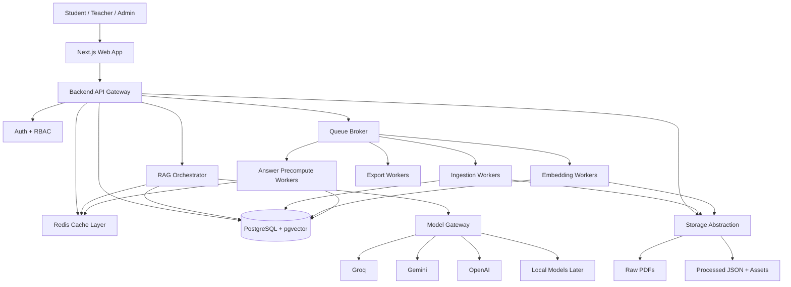
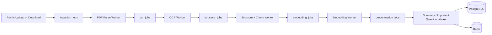

# System Architecture

## Architecture Goal

Build a local-first, cost-aware, retrieval-grounded AI study platform that can scale from developer laptop workflows to production exam-night traffic.

## High-Level Components

- Next.js web app for students, teachers, and admins
- Backend API service using NestJS or Fastify
- PostgreSQL for relational data
- pgvector for embeddings and vector search
- Redis for cache, rate limits, queues, and hot keys
- Worker services for ingestion, OCR, embeddings, pre-generation, and exports
- Local storage abstraction for PDFs and processed artifacts
- Model gateway for provider routing and fallback

## Full System Diagram

## Queue and Worker Architecture

## Backend Service Boundaries

| Module | Responsibilities |
| --- | --- |
| Auth | Login, sessions, RBAC |
| User | Profiles, plans, usage state |
| Content | Subjects, chapters, pages, content units, assets |
| Ingestion | Upload, download, parsing jobs, validation |
| Retrieval | BM25, vector search, reranking, confidence |
| Answer | Cache lookup, generation, citation packaging |
| Provider | Model registry, cost logging, fallback |
| Billing | Plans, quotas, priority logic |
| Admin | Provider management, exam mode, job monitoring |

## Request Lifecycle Summary

1. User submits question with optional subject/chapter/answer format.
2. API normalizes request and checks user plan and rate limits.
3. Cache lookup occurs before any live retrieval.
4. If needed, RAG orchestrator retrieves structured textbook units.
5. Routing layer selects template, cheap model, or fallback model.
6. Answer is returned with citations and stored in the appropriate cache layer.
7. Usage, latency, and quality telemetry are logged.

## Deployment Model

### Local Development

- Monorepo
- Docker Compose for PostgreSQL, Redis, and optional OCR services
- Local filesystem storage under `/storage`
- One API app, one web app, one worker app

### Production

- Web app behind CDN
- API autoscaled horizontally
- Worker pool autoscaled by queue depth
- PostgreSQL primary + read replicas
- Redis cluster
- Object storage replacing local filesystem behind storage abstraction

## Architecture Decisions

- Store parsed textbook content both in database and versioned JSON artifacts
- Use local-first storage contracts from day one to simplify debugging
- Separate ingestion jobs from student-facing API to protect latency
- Use cache and routing decisions as first-class domain logic, not infrastructure afterthoughts

## Key Failure Boundaries

- Provider failures must not break cached answer serving
- Ingestion failures must isolate to a textbook version, not corrupt the whole subject
- Worker backlog must not block core question-answer API
