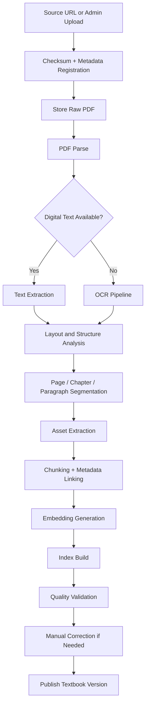

# Textbook Ingestion PRD

## Goal

Create a reliable textbook ingestion system that converts official Kerala SSLC textbook PDFs into structured, searchable, citation-ready study knowledge.

## Ingestion Objectives

- Support official-source download and admin upload
- Track source provenance, version, checksum, and timestamps
- Extract page text, headings, chapters, exercises, tables, graphs, diagrams, and images
- Handle scanned PDFs with OCR
- Support Malayalam and English
- Produce chunked, validated, indexed textbook units
- Enable manual correction before production use

## Core Inputs

- PDF URL from approved official source
- Admin-uploaded PDF
- Metadata: class, subject, medium, version label, academic year, publisher, notes

## Core Outputs

- Stored raw PDF
- Extracted per-page text
- Structured content units
- Visual assets and captions
- Chunk files
- Embeddings
- Search indexes
- Validation report

## Ingestion Lifecycle

## Admin Ingestion Workflow

## Content Units To Extract

- Subject
- Medium
- Chapter
- Section
- Subsection
- Page
- Paragraph
- Heading
- Definition
- Formula
- Table
- Graph
- Image
- Diagram
- Illustration
- Activity
- Experiment
- Exercise question
- Sub-question
- Answer hint
- Summary
- Glossary item

## Structured Extraction Rules

### Chapter Detection

- Prefer bookmark or table-of-contents signals if present
- Backfill using layout cues: large bold heading, chapter number patterns, repeated page templates
- Require human review when confidence is below threshold

### Paragraph Detection

- Preserve reading order
- Merge wrapped lines
- Split only on stable visual spacing or punctuation + layout cues
- Store page-relative bounding boxes for future UI highlighting

### Exercise Detection

- Detect headings such as exercise, questions, activities, evaluate, discuss
- Parse numbering hierarchy: `1`, `1(a)`, `i`, `ii`
- Link sub-questions to parent question record

### Visual Asset Detection

- Extract raster image snapshot
- Store nearby text before and after asset
- Capture caption
- Detect labels via OCR where needed

## Validation Stages

1. File validation
2. Source validation
3. Parse completeness validation
4. Structure validation
5. Embedding generation validation
6. Retrieval smoke test validation
7. Manual approval gate

## Manual Correction Requirements

- Editable OCR text by page
- Editable chapter boundaries
- Editable content-type labeling
- Asset relinking to nearby paragraphs
- Re-run only affected downstream steps after correction

## Acceptance Criteria

- Every published textbook version has checksum, source, and version metadata
- All student-facing content comes from approved textbook versions only
- Content units are linked to page and chapter
- OCR corrections are versioned and auditable
- Failed jobs expose exact failing stage and retry guidance
