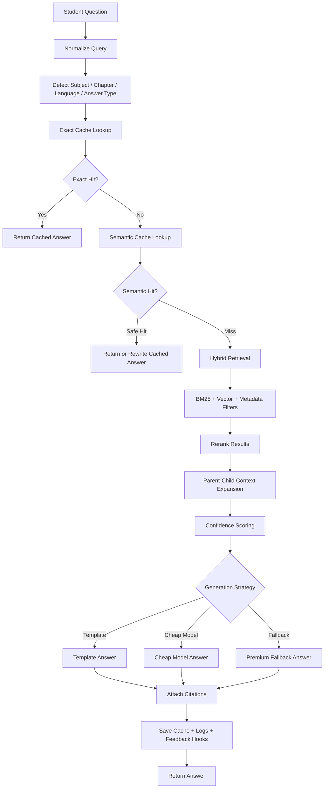

# RAG Pipeline

## Objective

Answer student questions using textbook-grounded retrieval with strong caching and minimal live model usage.

## Query Flow



## Input Contract

```json
{
  "question": "Explain photosynthesis in 3 marks",
  "language": "en",
  "subjectId": "biology_uuid",
  "chapterId": null,
  "answerType": "3_mark",
  "userPlan": "student_pro"
}
```

## Query Understanding

The orchestrator should infer:

- subject
- chapter
- requested language
- answer format
- difficulty
- whether the user asks about text, table, graph, diagram, or exercise

### Detection Methods

- UI-provided filters first
- Rule-based phrase matcher second
- Lightweight classifier third

## Retrieval Stages

### 1. Exact Cache

- Match normalized question + filters + answer type

### 2. Semantic Cache

- Compare question embedding against cached question embeddings

### 3. Hybrid Retrieval

- BM25 over normalized text
- Vector search over chunk embeddings
- Metadata filter by class, subject, medium, chapter, content type

## Hybrid Retrieval Score

```txt
final_score =
  0.35 * keyword_score +
  0.35 * vector_score +
  0.15 * metadata_match_score +
  0.10 * page_or_chapter_proximity_score +
  0.05 * historical_success_score
```

### Score Explanations

- `keyword_score`: BM25 or full-text relevance based on exact words and stems
- `vector_score`: semantic similarity between query embedding and content embedding
- `metadata_match_score`: reward when subject, chapter, language, and content type align
- `page_or_chapter_proximity_score`: boost adjacent paragraphs or same exercise group
- `historical_success_score`: reward sources that previously produced positive feedback

## Reranking

Use a cheap reranker or lightweight cross-encoder later. MVP fallback is a deterministic rerank pass using:

- question-content token overlap
- heading overlap
- answer-type suitability
- exercise/definition preference based on query intent

## Parent-Child Context Expansion

When a chunk matches strongly:

- include the parent section heading
- include adjacent paragraph before and after
- include linked table/diagram caption if relevant
- cap total context tokens to protect model cost

## Confidence Model

Confidence should combine:

- top-k score spread
- citation coverage
- chapter consistency
- content-type match
- cache or verified-answer status

### Suggested thresholds

- `0.90+`: answer can be served from cache or template confidently
- `0.75-0.89`: cheap model with strict citation grounding
- `<0.75`: cautious response, possibly say answer not clearly found

## Output Contract

```json
{
  "answerText": "Photosynthesis is the process by which green plants prepare food...",
  "answerType": "3_mark",
  "language": "en",
  "citations": [
    {
      "chapterTitle": "Life Processes",
      "pageNumber": 34,
      "contentUnitId": "unit_uuid"
    }
  ],
  "confidence": 0.91,
  "servedFrom": "hybrid_rag",
  "modelUsed": "cheap_model_name"
}
```

## Failure Handling

- No result: return textbook-not-found message plus closest chapter suggestions
- Low confidence: short answer with explicit caution
- Provider unavailable: serve best safe cached answer or retry fallback

## Acceptance Criteria

- Every live-generated answer includes source unit references
- Query flow logs cache path, retrieval path, and model path
- Low-confidence answers are never presented as certain textbook facts
