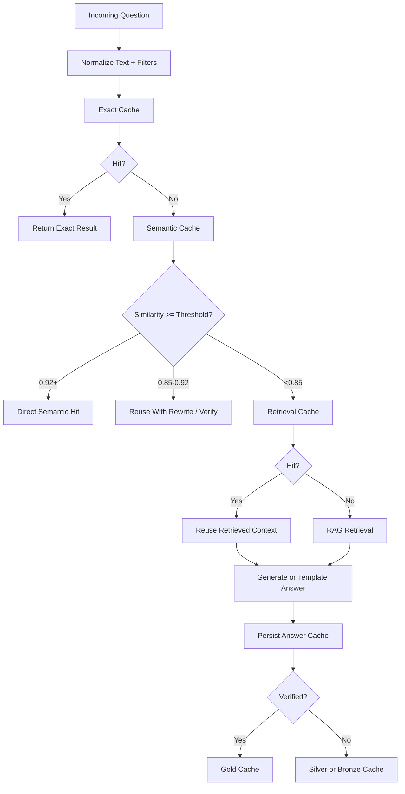

# Cache System

## Objective

Minimize live AI cost and improve latency through a layered cache system that stores reusable, textbook-grounded outputs.

## Cache Layers

1. Exact question cache
2. Semantic cache
3. Retrieval cache
4. Answer cache
5. Pre-generated chapter content cache
6. Verified answer cache
7. Exam-mode hot cache

## Cache Lookup Flow



## Cache Confidence Tiers

| Tier | Meaning | Serve Automatically? |
| --- | --- | --- |
| Gold | Teacher verified | Yes |
| Silver | Textbook-cited generated answer | Yes |
| Bronze | Temporary generated answer | Limited |
| Unsafe | Low-confidence or weakly grounded | No |

## Required Cached Fields

```json
{
  "question": "What is photosynthesis?",
  "normalizedQuestion": "what is photosynthesis",
  "language": "en",
  "subjectId": "biology_uuid",
  "chapterId": "chapter_uuid",
  "answerFormat": "1_mark",
  "answerText": "Photosynthesis is the process by which plants prepare food.",
  "citations": [{"pageNumber": 34, "contentUnitId": "unit_uuid"}],
  "confidenceScore": 0.94,
  "sourceContentUnitIds": ["unit_uuid"],
  "modelUsed": "cheap_model_name",
  "cacheType": "exact",
  "verificationStatus": "silver",
  "usageCount": 42,
  "positiveFeedbackCount": 15,
  "negativeFeedbackCount": 1,
  "lastServedAt": "2026-07-09T12:00:00Z",
  "expiresAt": null
}
```

## Cache Layer Behavior

### Exact Cache

- Keyed by normalized question + subject + chapter + language + answer format + textbook version
- Highest priority after access control

### Semantic Cache

- Keyed by query embedding
- Returns direct answer when similarity is `0.92+`
- Returns rewrite path when similarity is `0.85` to `0.92`

### Retrieval Cache

- Stores top retrieved content unit IDs for frequent questions
- Useful when answer text varies by format but source set stays stable

### Answer Cache

- Stores generated answer and citations
- Default destination for most reusable outputs

### Pre-generated Cache

- Stores chapter summaries, important questions, flashcards, revision notes

### Verified Cache

- Stores teacher-approved answers
- Treated as canonical when matching conditions align

### Exam Hot Cache

- Preloaded high-demand questions by subject/chapter
- Replicated aggressively in Redis during peak traffic

## Expiry Policy

| Cache Layer | Expiry Policy |
| --- | --- |
| Exact | No expiry unless textbook version changes or answer is downgraded |
| Semantic | Review after 30-90 days or if negative feedback rises |
| Retrieval | Rebuild on embedding version change |
| Answer | Invalidate on textbook version change or admin moderation |
| Hot cache | Short TTL but continuously refreshed in exam mode |

## Cache Invalidation Triggers

- New textbook version activated
- OCR correction on cited source unit
- Answer receives repeated negative feedback
- Teacher marks answer incorrect
- Embedding model or chunking version changes

## Cache Stampede Protection

- Use request coalescing by normalized query key
- Lock key for active live generation path
- Serve stale-but-safe cache while refresh occurs

## Acceptance Criteria

- Cache layers are independently observable
- Cache hit ratio is broken down by exact, semantic, retrieval, and pre-generated paths
- Semantic cache never serves low-confidence weakly grounded answers directly
