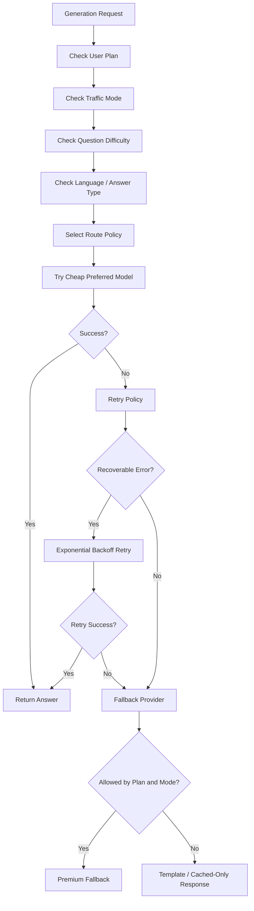
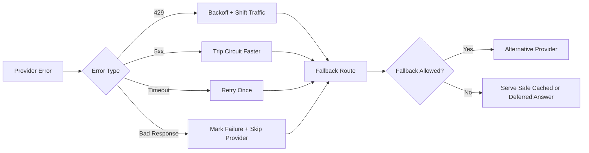

# Model Routing and Fallback

## Goal

Provide reliable answer generation while minimizing cost and isolating provider failures through a centralized model gateway.

## Supported Providers

- Groq
- Google Gemini
- OpenAI
- Local/self-hosted models later

## Gateway Responsibilities

- Unified provider interface
- Model registry
- API key management
- Cost tracking per input and output token
- RPM, TPM, daily, and monthly budget enforcement
- Latency and error tracking
- Retry and fallback policies
- Circuit breaker
- Provider disable switch

## Model Routing Flow



## Failure and Fallback Flow



## Routing Dimensions

- User plan
- Question difficulty
- Traffic mode
- Language
- Subject
- Answer type
- Feature type: Q&A, worksheet, summary, quiz, export

## Example Route Policies

### Free user + simple definition

`cache -> template -> cheap model only`

### Paid user + hard reasoning

`cache -> RAG -> cheap model -> stronger fallback`

### Exam mode

`cache -> pre-generated -> queue cheap model`

### Teacher worksheet

`RAG -> stronger model allowed -> save worksheet`

## Provider Registry Fields

```json
{
  "provider": "groq",
  "model": "example-model",
  "enabled": true,
  "supportsMalayalam": true,
  "supportsVision": false,
  "rpmLimit": 300,
  "tpmLimit": 200000,
  "dailyBudgetInr": 2500,
  "monthlyBudgetInr": 50000,
  "priority": 1
}
```

## Circuit Breaker Rules

- Open provider circuit when failure rate exceeds threshold over rolling window
- Half-open after cool-down
- Close again only after successful probe traffic

### Suggested thresholds

- 5 consecutive failures for hard open
- 20%+ error rate over last 50 calls for soft open
- 60-second cool-down initial window

## Pseudocode

```txt
if cache_hit:
  return cached_answer

route = select_route(user_plan, traffic_mode, difficulty, answer_type, language)

for candidate in route.models:
  if provider_budget_exceeded(candidate):
    continue
  if circuit_open(candidate.provider):
    continue
  result = call_model(candidate)
  if result.success:
    return result
  record_failure(candidate, result.error)

return safe_fallback_response()
```

## Acceptance Criteria

- Gateway logs every model attempt and cost
- Free users cannot hit premium fallback
- Provider outages degrade gracefully to cheaper or cached modes
- Routing policy can be updated without code deployment
