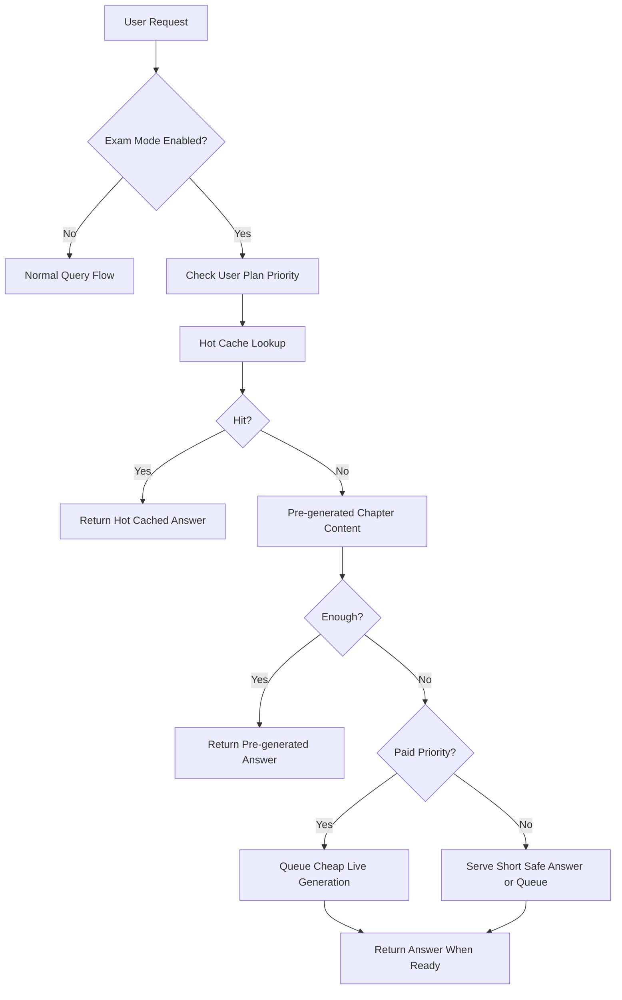

# Exam Mode

## Objective

Protect system reliability and unit economics during peak exam traffic while still delivering fast, useful answers to students.

## Activation Triggers

- Manual admin enable
- Scheduled exam-window enable
- Automatic recommendation when concurrency, queue depth, or provider failure crosses thresholds

## Exam Mode Behavior

- Prefer exact cache, semantic cache, and pre-generated answers
- Prefer verified and hot-cache answers
- Disable expensive fallback for free users
- Limit long-form live generation
- Shorten default answer length
- Disable long chat history
- Disable image upload analysis for free users
- Queue non-urgent generation tasks
- Prioritize paid students, teachers, and centers

## Exam Mode Flow

## User Experience Changes

- Large buttons for `1 Mark`, `3 Marks`, `5 Marks`
- Quick revision chips
- Important question lists
- Shorter answer templates
- Prominent note when request is queued

## Operational Changes

- Increase Redis hot-cache memory allocation
- Reduce live generation concurrency caps per free user
- Increase pre-generated content refresh priority
- Disable or reduce premium model lanes for most traffic

## Priority Rules

| User Type | Priority |
| --- | --- |
| School | Highest |
| Tuition Center | High |
| Teacher | High |
| Student Pro / Exam Pass | Medium |
| Free | Lowest |

## Queue Strategy

- Free non-urgent generation can be deferred
- Paid requests get shorter queue timeout
- If queue exceeds SLA, downgrade to safe cached-only or summary response

## Acceptance Criteria

- Exam mode can be toggled without restart
- Premium fallback is blocked for free users
- Hot cache serves important questions with sub-500 ms latency
- Queue and routing behavior visibly change when exam mode is active
