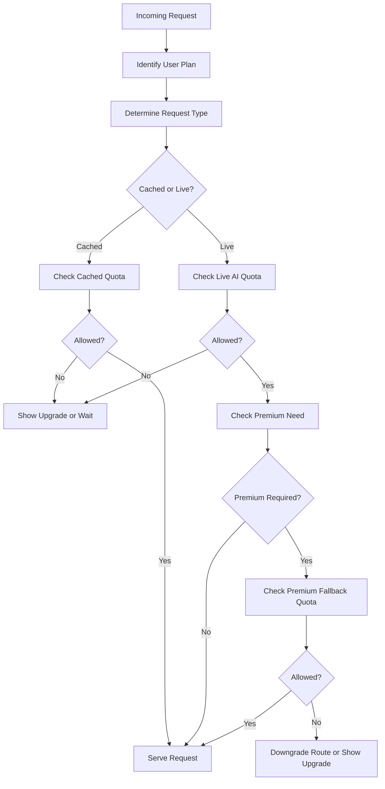

# Rate Limiting and Plans

## Objective

Align pricing, value delivery, and AI cost control by separating cheap cached usage from expensive live generation and premium fallback.

## Plans

1. Free
2. Student Pro
3. Exam Pass
4. Teacher
5. Tuition Center
6. School

## Suggested Pricing

| Plan | Suggested INR |
| --- | --- |
| Free | 0 |
| Student Pro | 149 to 249 / month |
| Exam Pass | 299 to 499 / exam season |
| Teacher | 799 to 1499 / month |
| Tuition Center | 2499 to 5999 / month |
| School | Custom annual pricing |

## Plan Limits

| Plan | Daily Cached Answers | Daily Live AI Answers | Daily Premium Fallback | Diagram/Image Analysis | Worksheet Generation | Priority |
| --- | --- | --- | --- | --- | --- | --- |
| Free | 80 | 10 | 0 | 0 to 2 | 0 | Low |
| Student Pro | 250 | 40 | 3 | 10 | 2 | Medium |
| Exam Pass | 400 | 60 | 5 | 10 | 2 | Medium-High |
| Teacher | 500 | 80 | 10 | 25 | 15 | High |
| Tuition Center | 2000 | 300 | 25 | 100 | 60 | High |
| School | Custom | Custom | Custom | Custom | Custom | Highest |

## Subscription and Rate-Limit Flow



## Quota Principles

- Cached answers are cheap and should have generous limits
- Live generation is costly and should be tighter
- Premium fallback must be very limited and plan-gated
- Teacher and institutional plans get queue priority and higher worksheet/export access

## Rate-Limit Pseudocode

```txt
plan = get_user_plan(user_id)
request_type = classify_request(request)

if request_type == "cached_answer":
  enforce_daily_limit(plan.cached_limit)
elif request_type == "live_answer":
  enforce_daily_limit(plan.live_limit)
elif request_type == "premium_fallback":
  enforce_daily_limit(plan.premium_limit)

enforce_rpm(plan.rpm_limit)
enforce_concurrency(plan.concurrent_limit)

if exam_mode_enabled:
  apply_exam_mode_overrides(plan, request_type)
```

## Additional Control Rules

- Separate per-minute rate limits from per-day usage quotas
- Apply IP/device abuse heuristics for anonymous or suspicious traffic
- Use plan priority when ordering queue jobs
- Support admin override grants for support cases

## Response Behavior on Limit Exceeded

- Cached quota exceeded: suggest retry tomorrow or upgrade
- Live quota exceeded: show cached-only mode or upgrade
- Premium quota exceeded: downgrade to cheap-model answer or queue
- Exam mode restriction: explicitly mention peak-traffic policy

## Acceptance Criteria

- Usage is tracked per answer class, not just per request
- Plan changes take effect immediately
- Exam mode can override live and premium limits without changing stored plan definitions
