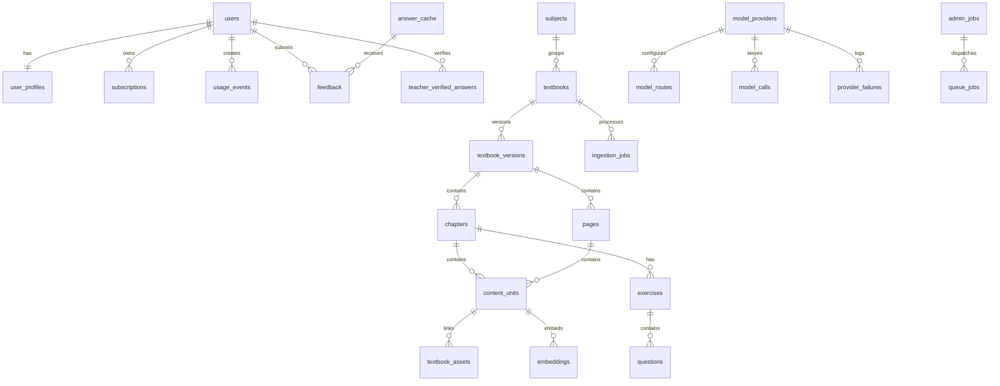

# Database Schema

## Objective

Use PostgreSQL + pgvector as the primary system of record for users, textbook metadata, structured content, retrieval, caching, provider routing, usage tracking, and operational jobs.

## Core Decisions

- PostgreSQL stores all transactional and relational data
- `pgvector` stores embeddings for content units and semantic cache entries
- Redis remains a serving cache and queue broker, not the long-term source of truth
- Large raw artifacts stay in local storage or object storage and are referenced from the database

## ER Diagram



## Extensions

```sql
CREATE EXTENSION IF NOT EXISTS "uuid-ossp";
CREATE EXTENSION IF NOT EXISTS vector;
```

## Naming Conventions

- IDs are UUIDs
- Timestamps use `TIMESTAMPTZ`
- Soft-delete only where operationally needed
- Status fields use constrained text enums or PostgreSQL enums

## Table Specifications

### `users`

- Purpose: authentication identity and account state
- Important fields: `id`, `email`, `password_hash`, `role`, `status`, `last_login_at`
- Indexes: unique `email`, index on `role`, index on `status`
- Foreign keys: none
- Constraints: email unique, role limited to student/teacher/admin/org_owner
- Example record: student account with active status

### `user_profiles`

- Purpose: user preferences and demographic settings
- Important fields: `user_id`, `full_name`, `preferred_language`, `school_name`, `class_level`
- Indexes: `user_id` unique
- Foreign keys: `user_id -> users.id`
- Constraints: `class_level = 10` for current MVP
- Example record: Malayalam-preferring SSLC student profile

### `subscriptions`

- Purpose: billing plan assignments and lifecycle
- Important fields: `user_id`, `plan_code`, `status`, `starts_at`, `ends_at`, `billing_reference`
- Indexes: `user_id`, `(status, ends_at)`
- Foreign keys: `user_id -> users.id`
- Constraints: one active subscription per user
- Example record: `student_pro` active until exam season end

### `usage_limits`

- Purpose: stored plan limit snapshots and overrides
- Important fields: `plan_code`, `cached_daily_limit`, `live_daily_limit`, `premium_daily_limit`, `priority_level`
- Indexes: unique `plan_code`
- Foreign keys: none
- Constraints: numeric limits non-negative
- Example record: free plan with zero premium fallback

### `usage_events`

- Purpose: atomic metering of user actions
- Important fields: `user_id`, `event_type`, `request_id`, `units`, `metadata`, `created_at`
- Indexes: `user_id`, `(event_type, created_at)`, `request_id`
- Foreign keys: `user_id -> users.id`
- Constraints: `units > 0`
- Example record: one live-answer event counted against daily quota

### `subjects`

- Purpose: canonical subject list
- Important fields: `id`, `name`, `code`, `class_level`, `syllabus`, `active`
- Indexes: unique `(code, class_level, syllabus)`
- Foreign keys: none
- Constraints: class level fixed to 10 in MVP
- Example record: Biology English-medium subject group

### `textbooks`

- Purpose: logical textbook identity
- Important fields: `subject_id`, `title`, `medium`, `publisher`, `class_level`, `syllabus`
- Indexes: `(subject_id, medium)`, `(class_level, syllabus)`
- Foreign keys: `subject_id -> subjects.id`
- Constraints: unique `(subject_id, medium, class_level, syllabus)`
- Example record: SSLC Biology English textbook

### `textbook_versions`

- Purpose: versioned textbook files and provenance
- Important fields: `textbook_id`, `version_label`, `academic_year`, `source_url`, `checksum_sha256`, `status`, `is_active`
- Indexes: `textbook_id`, unique `checksum_sha256`, partial unique on active version per textbook
- Foreign keys: `textbook_id -> textbooks.id`
- Constraints: only one active version per textbook
- Example record: `2026-v1`, approved, active

### `chapters`

- Purpose: textbook chapter metadata
- Important fields: `textbook_version_id`, `chapter_number`, `title`, `start_page`, `end_page`, `summary_cache_id`
- Indexes: `(textbook_version_id, chapter_number)`, title full-text index later
- Foreign keys: `textbook_version_id -> textbook_versions.id`
- Constraints: unique `(textbook_version_id, chapter_number)`
- Example record: Chapter 2 Life Processes

### `pages`

- Purpose: page-level extraction records
- Important fields: `textbook_version_id`, `chapter_id`, `page_number`, `raw_text`, `ocr_used`, `parse_confidence`, `storage_path`
- Indexes: `(textbook_version_id, page_number)`, `chapter_id`
- Foreign keys: `textbook_version_id -> textbook_versions.id`, `chapter_id -> chapters.id`
- Constraints: unique `(textbook_version_id, page_number)`
- Example record: page 34 with OCR false

### `content_units`

- Purpose: canonical structured content blocks for retrieval and citation
- Important fields: `page_id`, `chapter_id`, `parent_content_unit_id`, `content_type`, `text`, `normalized_text`, `language`, `keywords`, `content_hash`
- Indexes: `chapter_id`, `page_id`, `content_type`, GIN full-text on `normalized_text`, unique `content_hash`
- Foreign keys: `page_id -> pages.id`, `chapter_id -> chapters.id`, `parent_content_unit_id -> content_units.id`
- Constraints: supported `content_type` values only
- Example record: paragraph or definition unit with linked heading

### `textbook_assets`

- Purpose: generic storage for images, diagrams, illustrations, and table/graph snapshots
- Important fields: `content_unit_id`, `page_id`, `asset_type`, `file_path`, `caption_text`, `ocr_text`, `nearby_content_unit_ids`
- Indexes: `page_id`, `asset_type`, `content_unit_id`
- Foreign keys: `content_unit_id -> content_units.id`, `page_id -> pages.id`
- Constraints: asset path required
- Example record: diagram image with caption

### `tables`

- Purpose: structured textbook tables
- Important fields: `asset_id`, `content_unit_id`, `raw_table_text`, `structured_rows`, `column_headers`
- Indexes: `asset_id`, `content_unit_id`
- Foreign keys: `asset_id -> textbook_assets.id`, `content_unit_id -> content_units.id`
- Constraints: one-to-one with asset when asset_type is table
- Example record: table with JSON rows

### `graphs`

- Purpose: extracted chart/graph metadata
- Important fields: `asset_id`, `graph_type`, `axis_x_label`, `axis_y_label`, `caption_text`, `generated_explanation`
- Indexes: `asset_id`, `graph_type`
- Foreign keys: `asset_id -> textbook_assets.id`
- Constraints: one-to-one with graph asset
- Example record: line graph with axis labels

### `diagrams`

- Purpose: extracted diagram metadata and labels
- Important fields: `asset_id`, `caption_text`, `label_map`, `generated_description`, `possible_questions`
- Indexes: `asset_id`
- Foreign keys: `asset_id -> textbook_assets.id`
- Constraints: one-to-one with diagram asset
- Example record: heart diagram with OCR label map

### `exercises`

- Purpose: chapter-level exercise containers
- Important fields: `chapter_id`, `title`, `page_start`, `page_end`, `exercise_type`
- Indexes: `chapter_id`, `exercise_type`
- Foreign keys: `chapter_id -> chapters.id`
- Constraints: title required
- Example record: end-of-chapter exercise block

### `questions`

- Purpose: extracted exercise questions and sub-questions
- Important fields: `exercise_id`, `parent_question_id`, `question_number`, `question_text`, `marks_hint`, `answer_hint`
- Indexes: `exercise_id`, `parent_question_id`, `(exercise_id, question_number)`
- Foreign keys: `exercise_id -> exercises.id`, `parent_question_id -> questions.id`
- Constraints: question text required
- Example record: `1(a)` short question

### `embeddings`

- Purpose: vector storage for content units or cache entries
- Important fields: `content_unit_id`, `embedding_model`, `embedding_vector`, `embedding_version`, `content_hash`
- Indexes: HNSW/IVFFlat on `embedding_vector`, `content_unit_id`, `(embedding_model, embedding_version)`
- Foreign keys: `content_unit_id -> content_units.id`
- Constraints: vector dimensions fixed per model version
- Example record: 768-dimensional embedding for paragraph unit

### `retrieval_logs`

- Purpose: observability for retrieval quality and debugging
- Important fields: `request_id`, `user_id`, `question`, `filters`, `retrieved_unit_ids`, `scores`, `confidence`
- Indexes: `request_id`, `user_id`, `created_at`
- Foreign keys: `user_id -> users.id`
- Constraints: request ID unique per API request
- Example record: top-5 results for a Biology question

### `answer_cache`

- Purpose: persistent answer reuse store
- Important fields: `normalized_question`, `subject_id`, `chapter_id`, `language`, `answer_format`, `answer_text`, `citations`, `confidence_score`, `verification_status`
- Indexes: composite lookup index on question/filter fields, `verification_status`, `last_served_at`
- Foreign keys: `subject_id -> subjects.id`, `chapter_id -> chapters.id`
- Constraints: question and answer text required
- Example record: Silver cached 3-mark answer

### `semantic_cache`

- Purpose: vector-based reusable question-answer cache
- Important fields: `question_text`, `normalized_question`, `question_embedding`, `answer_cache_id`, `similarity_floor`
- Indexes: vector index on `question_embedding`, `answer_cache_id`
- Foreign keys: `answer_cache_id -> answer_cache.id`
- Constraints: similarity floor between 0 and 1
- Example record: reusable answer for similar phrasing

### `exact_cache`

- Purpose: fast deterministic key-value cache metadata persisted in SQL
- Important fields: `cache_key`, `answer_cache_id`, `textbook_version_id`, `hit_count`
- Indexes: unique `cache_key`, `answer_cache_id`
- Foreign keys: `answer_cache_id -> answer_cache.id`, `textbook_version_id -> textbook_versions.id`
- Constraints: unique cache key
- Example record: exact question key for chapter-filtered answer

### `model_calls`

- Purpose: every attempted provider invocation
- Important fields: `request_id`, `provider_id`, `route_id`, `model_name`, `status`, `input_tokens`, `output_tokens`, `latency_ms`, `cost_inr`
- Indexes: `request_id`, `provider_id`, `created_at`, `(status, created_at)`
- Foreign keys: `provider_id -> model_providers.id`, `route_id -> model_routes.id`
- Constraints: non-negative cost and tokens
- Example record: successful cheap model answer generation

### `model_providers`

- Purpose: provider and model registry
- Important fields: `provider_name`, `model_name`, `enabled`, `priority`, `supports_malayalam`, `supports_vision`, `daily_budget_inr`
- Indexes: `(provider_name, model_name)` unique, `enabled`, `priority`
- Foreign keys: none
- Constraints: unique provider-model pair
- Example record: Groq cheap text model enabled

### `model_routes`

- Purpose: routing policy definitions
- Important fields: `route_code`, `user_plan`, `traffic_mode`, `difficulty`, `language`, `answer_type`, `ordered_provider_ids`
- Indexes: `route_code` unique, `(user_plan, traffic_mode, answer_type)`
- Foreign keys: none or JSON references to provider IDs
- Constraints: route code required
- Example record: free-simple-exam-mode route

### `provider_failures`

- Purpose: provider health and incident log
- Important fields: `provider_id`, `error_type`, `status_code`, `failure_count_window`, `circuit_state`
- Indexes: `provider_id`, `created_at`, `(provider_id, circuit_state)`
- Foreign keys: `provider_id -> model_providers.id`
- Constraints: circuit state limited to closed/open/half_open
- Example record: burst of 429 failures

### `feedback`

- Purpose: user quality feedback for answers
- Important fields: `user_id`, `answer_cache_id`, `rating`, `feedback_text`, `issue_type`
- Indexes: `user_id`, `answer_cache_id`, `created_at`
- Foreign keys: `user_id -> users.id`, `answer_cache_id -> answer_cache.id`
- Constraints: rating range 1-5 or thumbs schema
- Example record: answer marked helpful

### `teacher_verified_answers`

- Purpose: teacher moderation and Gold cache promotion
- Important fields: `teacher_user_id`, `answer_cache_id`, `status`, `notes`, `verified_at`
- Indexes: `teacher_user_id`, `answer_cache_id`, `status`
- Foreign keys: `teacher_user_id -> users.id`, `answer_cache_id -> answer_cache.id`
- Constraints: unique active verification per answer
- Example record: teacher approved answer with minor note

### `admin_jobs`

- Purpose: admin-triggered long-running operational actions
- Important fields: `job_type`, `initiated_by_user_id`, `status`, `payload`, `started_at`, `finished_at`
- Indexes: `status`, `job_type`, `initiated_by_user_id`
- Foreign keys: `initiated_by_user_id -> users.id`
- Constraints: payload required for reproducibility
- Example record: rebuild embeddings for Biology English

### `ingestion_jobs`

- Purpose: track textbook ingest lifecycle
- Important fields: `textbook_version_id`, `status`, `stage`, `error_message`, `retry_count`, `metrics`
- Indexes: `textbook_version_id`, `status`, `stage`
- Foreign keys: `textbook_version_id -> textbook_versions.id`
- Constraints: stage limited to registered/downloaded/parsed/ocr/structured/indexed/published
- Example record: OCR stage in progress

### `queue_jobs`

- Purpose: app-level queue audit trail
- Important fields: `queue_name`, `job_reference`, `status`, `priority`, `attempts`, `available_at`
- Indexes: `(queue_name, status)`, `job_reference`, `priority`
- Foreign keys: optional `admin_job_id -> admin_jobs.id`
- Constraints: queue name required
- Example record: high-priority exam hot-cache precompute job

### `exam_mode_settings`

- Purpose: active traffic-mode policy settings
- Important fields: `enabled`, `starts_at`, `ends_at`, `free_premium_disabled`, `short_answer_default`, `queue_threshold`
- Indexes: `enabled`
- Foreign keys: none
- Constraints: only one active config row
- Example record: exam mode on for March window

### `rate_limit_rules`

- Purpose: fine-grained policy beyond plan defaults
- Important fields: `scope_type`, `scope_value`, `request_type`, `rpm_limit`, `daily_limit`, `concurrency_limit`, `active`
- Indexes: `(scope_type, scope_value, request_type)`, `active`
- Foreign keys: none
- Constraints: numeric limits non-negative
- Example record: stricter live-answer rule for free users during exam mode

## SQL Schema Examples

### Users and Profiles

```sql
CREATE TABLE users (
  id UUID PRIMARY KEY DEFAULT uuid_generate_v4(),
  email TEXT NOT NULL UNIQUE,
  password_hash TEXT NOT NULL,
  role TEXT NOT NULL CHECK (role IN ('student', 'teacher', 'admin', 'org_owner')),
  status TEXT NOT NULL DEFAULT 'active' CHECK (status IN ('active', 'suspended', 'pending')),
  last_login_at TIMESTAMPTZ,
  created_at TIMESTAMPTZ NOT NULL DEFAULT now(),
  updated_at TIMESTAMPTZ NOT NULL DEFAULT now()
);

CREATE TABLE user_profiles (
  id UUID PRIMARY KEY DEFAULT uuid_generate_v4(),
  user_id UUID NOT NULL UNIQUE REFERENCES users(id) ON DELETE CASCADE,
  full_name TEXT,
  preferred_language TEXT NOT NULL DEFAULT 'en' CHECK (preferred_language IN ('en', 'ml')),
  class_level INT NOT NULL DEFAULT 10 CHECK (class_level = 10),
  school_name TEXT,
  created_at TIMESTAMPTZ NOT NULL DEFAULT now(),
  updated_at TIMESTAMPTZ NOT NULL DEFAULT now()
);
```

### Textbooks and Versions

```sql
CREATE TABLE textbooks (
  id UUID PRIMARY KEY DEFAULT uuid_generate_v4(),
  subject_id UUID NOT NULL REFERENCES subjects(id),
  title TEXT NOT NULL,
  medium TEXT NOT NULL CHECK (medium IN ('en', 'ml')),
  publisher TEXT,
  class_level INT NOT NULL CHECK (class_level = 10),
  syllabus TEXT NOT NULL DEFAULT 'Kerala SSLC',
  created_at TIMESTAMPTZ NOT NULL DEFAULT now(),
  updated_at TIMESTAMPTZ NOT NULL DEFAULT now(),
  UNIQUE (subject_id, medium, class_level, syllabus)
);

CREATE TABLE textbook_versions (
  id UUID PRIMARY KEY DEFAULT uuid_generate_v4(),
  textbook_id UUID NOT NULL REFERENCES textbooks(id),
  version_label TEXT NOT NULL,
  academic_year TEXT,
  source_url TEXT,
  checksum_sha256 TEXT NOT NULL UNIQUE,
  storage_path TEXT NOT NULL,
  status TEXT NOT NULL CHECK (status IN ('draft', 'processing', 'approved', 'published', 'archived')),
  is_active BOOLEAN NOT NULL DEFAULT false,
  downloaded_at TIMESTAMPTZ,
  created_at TIMESTAMPTZ NOT NULL DEFAULT now(),
  updated_at TIMESTAMPTZ NOT NULL DEFAULT now()
);

CREATE UNIQUE INDEX one_active_version_per_textbook
ON textbook_versions(textbook_id)
WHERE is_active = true;
```

### Content Units and Embeddings

```sql
CREATE TABLE content_units (
  id UUID PRIMARY KEY DEFAULT uuid_generate_v4(),
  page_id UUID NOT NULL REFERENCES pages(id) ON DELETE CASCADE,
  chapter_id UUID NOT NULL REFERENCES chapters(id) ON DELETE CASCADE,
  parent_content_unit_id UUID REFERENCES content_units(id),
  content_type TEXT NOT NULL CHECK (
    content_type IN (
      'chapter_heading', 'section_heading', 'subsection_heading', 'paragraph',
      'definition', 'formula', 'table_ref', 'graph_ref', 'diagram_ref',
      'activity', 'experiment', 'exercise', 'question', 'sub_question',
      'answer_hint', 'summary', 'glossary'
    )
  ),
  text TEXT NOT NULL,
  normalized_text TEXT NOT NULL,
  language TEXT NOT NULL CHECK (language IN ('en', 'ml', 'mixed')),
  keywords TEXT[] DEFAULT '{}',
  content_hash TEXT NOT NULL UNIQUE,
  metadata JSONB NOT NULL DEFAULT '{}'::jsonb,
  created_at TIMESTAMPTZ NOT NULL DEFAULT now(),
  updated_at TIMESTAMPTZ NOT NULL DEFAULT now()
);

CREATE INDEX content_units_page_idx ON content_units(page_id);
CREATE INDEX content_units_chapter_idx ON content_units(chapter_id);
CREATE INDEX content_units_type_idx ON content_units(content_type);
CREATE INDEX content_units_fts_idx
ON content_units
USING GIN (to_tsvector('simple', normalized_text));

CREATE TABLE embeddings (
  id UUID PRIMARY KEY DEFAULT uuid_generate_v4(),
  content_unit_id UUID NOT NULL REFERENCES content_units(id) ON DELETE CASCADE,
  embedding_model TEXT NOT NULL,
  embedding_version TEXT NOT NULL,
  embedding_vector VECTOR(768) NOT NULL,
  content_hash TEXT NOT NULL,
  created_at TIMESTAMPTZ NOT NULL DEFAULT now()
);

CREATE INDEX embeddings_hnsw_idx
ON embeddings
USING hnsw (embedding_vector vector_cosine_ops);
```

### Cache Tables

```sql
CREATE TABLE answer_cache (
  id UUID PRIMARY KEY DEFAULT uuid_generate_v4(),
  normalized_question TEXT NOT NULL,
  subject_id UUID REFERENCES subjects(id),
  chapter_id UUID REFERENCES chapters(id),
  language TEXT NOT NULL CHECK (language IN ('en', 'ml')),
  answer_format TEXT NOT NULL,
  answer_text TEXT NOT NULL,
  citations JSONB NOT NULL DEFAULT '[]'::jsonb,
  confidence_score NUMERIC(4,3) NOT NULL,
  source_content_unit_ids UUID[] NOT NULL DEFAULT '{}',
  model_used TEXT,
  cache_type TEXT NOT NULL,
  verification_status TEXT NOT NULL CHECK (verification_status IN ('gold', 'silver', 'bronze', 'unsafe')),
  usage_count INT NOT NULL DEFAULT 0,
  positive_feedback_count INT NOT NULL DEFAULT 0,
  negative_feedback_count INT NOT NULL DEFAULT 0,
  last_served_at TIMESTAMPTZ,
  expires_at TIMESTAMPTZ,
  created_at TIMESTAMPTZ NOT NULL DEFAULT now()
);

CREATE INDEX answer_cache_lookup_idx
ON answer_cache (normalized_question, language, answer_format, subject_id, chapter_id);

CREATE TABLE semantic_cache (
  id UUID PRIMARY KEY DEFAULT uuid_generate_v4(),
  question_text TEXT NOT NULL,
  normalized_question TEXT NOT NULL,
  question_embedding VECTOR(768) NOT NULL,
  answer_cache_id UUID NOT NULL REFERENCES answer_cache(id) ON DELETE CASCADE,
  similarity_floor NUMERIC(4,3) NOT NULL DEFAULT 0.850,
  created_at TIMESTAMPTZ NOT NULL DEFAULT now()
);
```

### Model Provider Tables

```sql
CREATE TABLE model_providers (
  id UUID PRIMARY KEY DEFAULT uuid_generate_v4(),
  provider_name TEXT NOT NULL,
  model_name TEXT NOT NULL,
  enabled BOOLEAN NOT NULL DEFAULT true,
  priority INT NOT NULL DEFAULT 1,
  supports_malayalam BOOLEAN NOT NULL DEFAULT true,
  supports_vision BOOLEAN NOT NULL DEFAULT false,
  rpm_limit INT,
  tpm_limit INT,
  daily_budget_inr NUMERIC(12,2),
  monthly_budget_inr NUMERIC(12,2),
  created_at TIMESTAMPTZ NOT NULL DEFAULT now(),
  updated_at TIMESTAMPTZ NOT NULL DEFAULT now(),
  UNIQUE (provider_name, model_name)
);

CREATE TABLE model_calls (
  id UUID PRIMARY KEY DEFAULT uuid_generate_v4(),
  request_id UUID NOT NULL,
  provider_id UUID NOT NULL REFERENCES model_providers(id),
  route_id UUID,
  model_name TEXT NOT NULL,
  status TEXT NOT NULL,
  input_tokens INT NOT NULL DEFAULT 0,
  output_tokens INT NOT NULL DEFAULT 0,
  latency_ms INT NOT NULL,
  cost_inr NUMERIC(12,4) NOT NULL DEFAULT 0,
  error_type TEXT,
  created_at TIMESTAMPTZ NOT NULL DEFAULT now()
);
```

## Example Record

```json
{
  "content_units": {
    "id": "sslc_biology_en_ch02_p034_para_005",
    "content_type": "paragraph",
    "language": "en",
    "text": "Extracted paragraph text",
    "normalized_text": "cleaned paragraph text",
    "content_hash": "sha256_hash"
  }
}
```

## Migration Notes

- Start with Prisma or Drizzle migrations for relational schema
- Use raw SQL migrations for pgvector indexes if ORM support is limited
- Partition `usage_events`, `model_calls`, and `retrieval_logs` by month in later phases

## Acceptance Criteria

- Every required table exists with primary indexes and foreign keys
- Embedding tables support pgvector indexing
- Cache and usage tables support cost, quality, and moderation workflows
- Textbook versioning prevents destructive overwrite of historical source data
