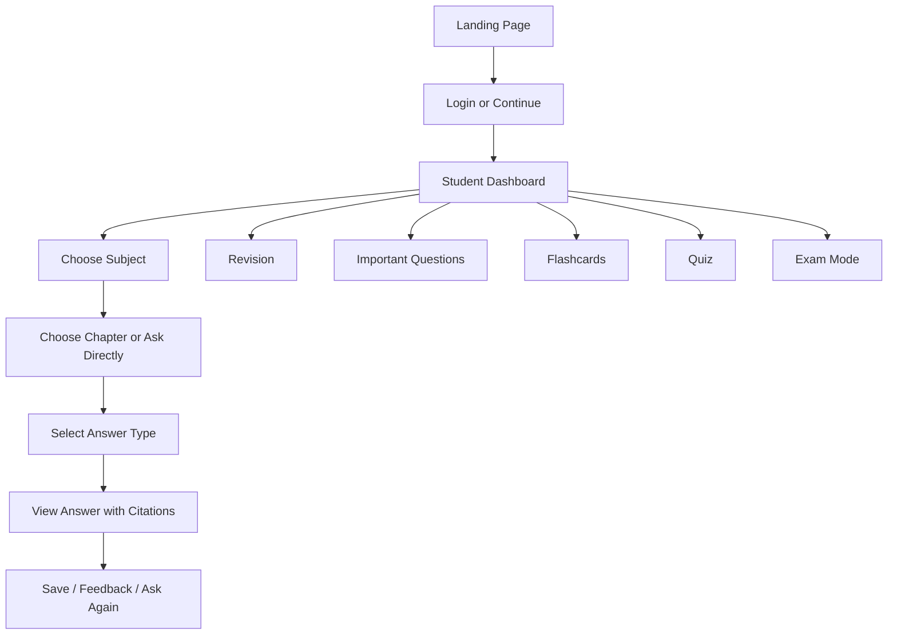

# Student Web App UX

## UX Goal

Create a fast, minimal, mobile-first web experience that feels like an exam-prep assistant rather than a generic chat app.

## Design Direction

- Clean
- Minimal
- Fast
- Student-friendly
- Mobile-first
- Bilingual
- Apple/Vercel/shadcn-style polish
- Strong citation visibility
- Large exam-mode controls

## Core Pages

- Landing page
- Login/signup
- Student dashboard
- Subject selector
- Chapter selector
- Ask question page
- Chat interface
- Chapter revision page
- Important questions page
- Flashcards page
- Quiz page
- Exam mode page
- Answer history
- Subscription page
- Teacher dashboard
- Admin dashboard

## User Journey Diagram

## Information Architecture

### Student Dashboard

- Continue previous subject
- Quick actions: Ask, Revise, Important Questions, Flashcards, Quiz
- Exam mode banner when active
- Usage summary and plan status

### Ask Question Experience

- Subject dropdown
- Chapter dropdown
- Answer format buttons
- Language toggle
- Question input
- Result card with citations and feedback buttons

### Answer Card

- Answer title
- Answer text
- Chapter/page citation chips
- `Explain simpler` action
- `Malayalam` / `English` toggle
- `1 Mark` / `3 Marks` / `5 Marks` regenerate from same context if allowed

## Exam Mode UX

- Prominent header
- Big quick-answer buttons
- Important-question shortcuts
- Queue notice for non-urgent live requests

## Accessibility and Language

- Malayalam-friendly font rendering
- Clear contrast
- Touch-friendly controls
- Avoid dense chat bubbles and hidden menus

## Acceptance Criteria

- Key actions are reachable in two to three taps on mobile
- Citations are visible without opening a hidden panel
- Student can switch answer format without re-entering question
